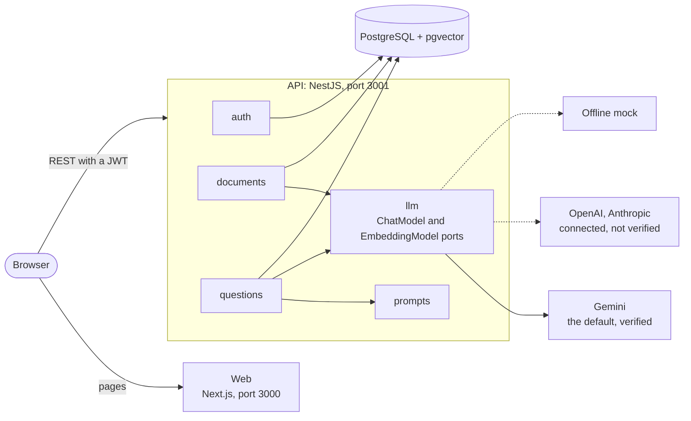
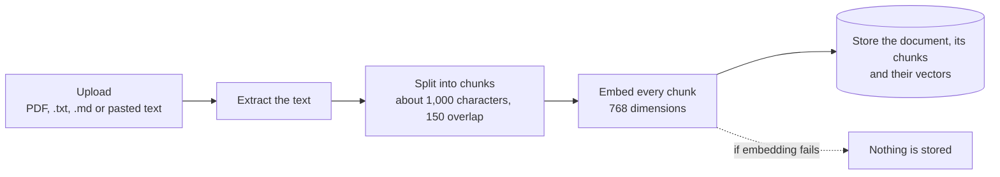
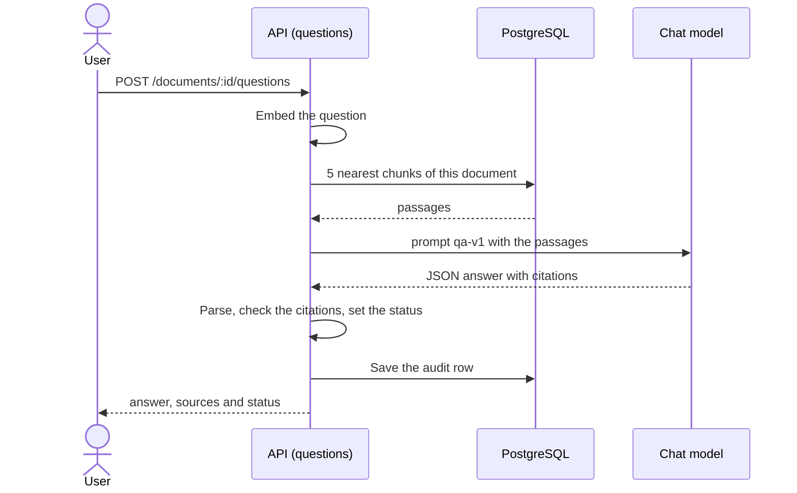
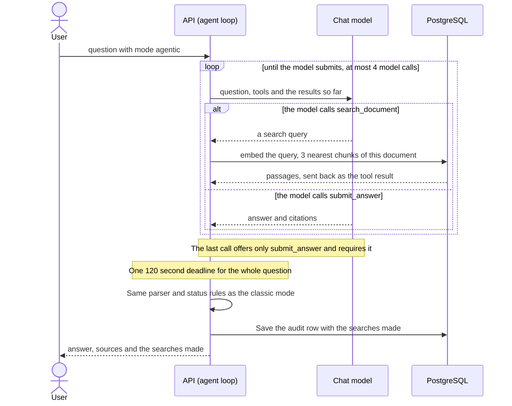
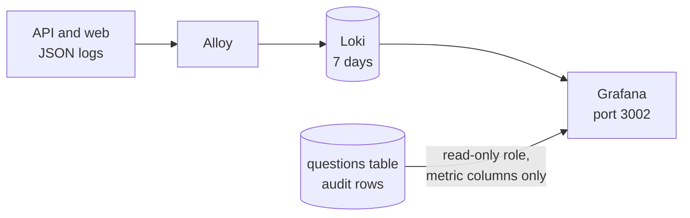
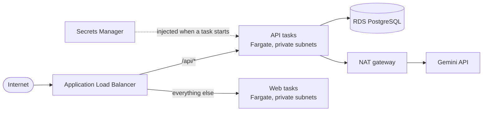

# Document Q&A Assistant

Upload a document, ask questions about it, and get answers grounded in that
document with the passages they came from.

This is my submission for the Full Stack AI Engineer assessment. The brief is in
[docs/CHALLENGE.md](docs/CHALLENGE.md) and the full design, with every decision
and its trade-off, is in
[docs/superpowers/specs](docs/superpowers/specs/2026-10-03-document-qa-assistant-design.md).

## What the brief asks, and where it is

"Built" means it runs and has tests. "Explained" means the brief asked for an explanation
and it is written in this README, without building it.

| The brief asks for | Status | Built with | Where to read |
|---|---|---|---|
| One use case, simplified and explained | Built | Questions and answers over documents | [Scope choices](#scope-choices) |
| Node backend, REST API, one AI endpoint, persistence, authentication | Built | NestJS 12, PostgreSQL with pgvector, JWT | [Architecture](#architecture) |
| Prompt construction, model invocation and post-processing kept apart | Built | `src/prompts/`, `src/llm/`, `answer-parser.ts` | [Three separate steps](#three-separate-steps) |
| Switch LLM providers | Built | One LangChain adapter for Gemini, OpenAI and Anthropic, plus an offline mock. Only Gemini is verified against a real API | [Switching providers](#switching-providers) |
| Prompt versioning | Built | One file per version, stored with every answer | [Prompt versioning](#prompt-versioning) |
| Prompt injection, costs and rate limits | Explained, and the limits are built | Four layers; per-user limits; costs measured against the real provider | [Prompt injection](#prompt-injection), [Cost and rate limits](#cost-and-rate-limits) |
| Frontend with 2+ pages, a form, loading, error and empty states | Built | Next.js 16 | [Frontend](#frontend) |
| Model status, re-asking, uncertainty | Built | "Thinking", "Edit and ask again", the `answered`, `unverified` and `not_found` badges. No partial results | [Frontend](#frontend) |
| Data stored, retention, PII, logging, auditability | Explained, with logs and audit built | JSON logs without content, an audit row per answer | [Data](#data-what-is-stored-and-for-how-long), [PII, logging and auditability](#pii-logging-and-auditability) |
| Bonus: embeddings and RAG with a vector store | Built | pgvector, exact search per document | [Retrieval](#retrieval) |
| Output quality, regressions, wrong answers | Explained | A golden set and four measures | [Evaluation and reliability](#evaluation-and-reliability) |
| Terraform, secrets without plaintext, config apart from code | Built, validated, never applied | ECS Fargate, RDS, Secrets Manager | [Infrastructure](#infrastructure) |
| Where keys live, rotation, scaling under bursts | Explained | Secrets Manager; autoscaling on requests per task | [Infrastructure](#infrastructure) |
| Docker for backend and frontend, deployment, scaling limits of AI | Built and explained | Docker Compose locally; ECS Fargate | [Run locally](#run-locally), [Infrastructure](#infrastructure) |
| Bonus: tool calling | Built | The agentic answer mode | [Answer modes](#answer-modes) |
| Bonus: cost for 1k, 10k and 100k requests | Built | Measured tokens against the real provider | [Cost estimate](#cost-estimate) |
| Bonus: multi-tenant isolation | Built for data | Per-user isolation in SQL; prompts are shared | [Bonus sections covered](#bonus-sections-covered) |
| Bonus: streaming, queues and workers | Not built | | [Known limitations](#trade-offs-and-known-limitations) |

Beyond the brief: a demo account, per-request logs, and optional Grafana dashboards over
the audit table and the live backend logs (see [Observability](#observability)).

**Not verified:** OpenAI and Anthropic against their real APIs (no keys), the Terraform
against a real AWS account, and Gemini's quotas, which only Google AI Studio shows.

## Run locally

Requirements: Docker.

```bash
cp .env.example .env
# Set GEMINI_API_KEY in .env (free at https://aistudio.google.com/apikey),
# or set LLM_PROVIDER=mock to run offline with fake answers.
docker compose up --build
```

Open http://localhost:3000 and sign in with the demo account, or create your own:

| Email | Password |
|---|---|
| `test@test.com` | `test-password` |

The API creates the demo account at startup from `DEMO_USER_EMAIL` and
`DEMO_USER_PASSWORD` in `.env`. These are public credentials for trying the app:
leave both empty wherever other people can reach the API. The Terraform never
sets them.

Upload a document and ask a question about it. A good first one is
[docs/CHALLENGE.md](docs/CHALLENGE.md) (the brief itself): try "Which backend
technologies are allowed?", then something it does not cover, such as "What is
the CEO's name?", to see the `not_found` status. The API listens on
http://localhost:3001/api.

Interactive API docs (Swagger UI) are at http://localhost:3001/api/docs. Call
`POST /auth/register`, paste the returned `accessToken` into **Authorize**, and
the other routes are ready to try.

| What | Address |
|---|---|
| Web app | http://localhost:3000 |
| API | http://localhost:3001/api |
| API docs (Swagger) | http://localhost:3001/api/docs |
| Grafana, only with the observability profile | http://localhost:3002 (`admin` / `admin`) |
| PostgreSQL | `localhost:5432` |

Everything listens on `127.0.0.1` only. To also start Grafana, Loki and Alloy, run
`docker compose --profile observability up --build` (see [Observability](#observability)).
To stop and delete the database, run `docker compose down -v`.

### Try it

```bash
API=localhost:3001/api
JSON='Content-Type: application/json'

# Register and keep the token
TOKEN=$(curl -s -X POST $API/auth/register -H "$JSON" \
  -d '{"email":"you@example.com","password":"correct-horse"}' | sed 's/.*"accessToken":"\([^"]*\)".*/\1/')

# Upload a document: a PDF, .txt or .md file, or pasted text
curl -s -X POST $API/documents -H "Authorization: Bearer $TOKEN" -F 'file=@./my-document.pdf'

# Ask a question, using the id returned above
curl -s -X POST $API/documents/<id>/questions -H "Authorization: Bearer $TOKEN" -H "$JSON" \
  -d '{"question":"What does the document say about termination?"}'
```

### Develop without Docker

```bash
docker compose up -d db
cd apps/api
pnpm install
pnpm start:dev   # reads the root .env
pnpm test        # unit tests, no database needed
pnpm test:int    # integration tests against the Compose database

cd ../web
pnpm install
pnpm dev         # http://localhost:3000
pnpm test
```

## What the answer looks like

Every answer is a structured object, not free text:

```json
{
  "status": "answered",
  "answer": "Either party can terminate with 30 days written notice.",
  "citations": [{ "chunkIndex": 4, "content": "The service contract can be terminated..." }],
  "usage": { "inputTokens": 1843, "outputTokens": 61 },
  "model": "gemini-3.1-flash-lite",
  "promptVersion": "qa-v1",
  "mode": "classic",
  "searches": [],
  "modelCalls": 1
}
```

| Status | Meaning |
|---|---|
| `answered` | The model answered and cited at least one passage that was really sent to it |
| `unverified` | The model answered but cited nothing valid, so the answer cannot be tied to the document |
| `not_found` | The model reports that the document does not cover the question |

The model is not asked how confident it is, because self-reported confidence is
poorly calibrated. Uncertainty is derived from citations, which can be checked.

## Architecture

A Next.js frontend, a modular NestJS monolith, PostgreSQL with pgvector, and
Docker Compose.

| Module | Responsibility |
|---|---|
| `auth` | Register, login, global JWT guard |
| `documents` | Upload and ingestion: extract text, chunk, embed, store |
| `questions` | The AI endpoint: retrieve, build prompt, invoke, post-process, store |
| `llm` | Ports for the chat and embedding models, one LangChain chat adapter for Gemini, OpenAI and Anthropic, and the offline mock |
| `prompts` | Versioned prompt templates |
| `database` | Drizzle schema and migrations |



The browser talks to the API directly, and the web app only serves pages. The
provider is chosen by `LLM_PROVIDER` in `.env`; the rest of the code only sees the
two ports.

### What happens when a document is uploaded



## AI design

### Three separate steps

The brief asks for a clear separation between prompt construction, model
invocation and response post-processing. Each one is its own unit:

| Step | Where | Notes |
|---|---|---|
| Prompt construction | `src/prompts/qa-v1.ts` | A pure function of the question and the retrieved passages |
| Model invocation | `src/llm/` | A `ChatModel` port; the service never imports a vendor SDK |
| Post-processing | `src/questions/answer-parser.ts` | A pure function: validates the JSON, checks citations, derives the status |

`QuestionsService.ask` runs them in order and stores an audit record with the
prompt version, provider, model, token counts, latency and the passages that
were retrieved. The agentic mode has the same three steps: the prompt in
`src/prompts/agent-v1.ts`, the invocation through the loop in
`src/questions/agent-loop.ts`, and the same `answer-parser.ts` after it.

### Switching providers

`LLM_PROVIDER` selects the chat model and `EMBEDDING_PROVIDER` the embedding model.
Both are plain settings: someone with an OpenAI or Anthropic key sets it in `.env`
and restarts the API.

| Provider | Chat | Embeddings | Status |
|---|---|---|---|
| `gemini` | `gemini-3.1-flash-lite` | `gemini-embedding-001` | Verified against the real API |
| `openai` | `gpt-4o-mini` | `text-embedding-3-small` | Wired and unit-tested, **not verified**: I have no key |
| `anthropic` | `claude-haiku-4-5` | none | Wired and unit-tested, **not verified**. Anthropic has no embedding model, so `EMBEDDING_PROVIDER` is required |
| `mock` | offline fake answers | offline fake vectors | Verified, needs no key |

Chat goes through LangChain: one adapter, `LangChainChatModel`, serves the three real
providers behind our own `ChatModel` port, so nothing outside `src/llm` knows
LangChain. The adapter owns retries (3 attempts, 30 seconds each), the per-attempt
timeout, the cancellation signal and the mapping of provider errors, so every
provider behaves the same. Adding a provider is one case in each of `createChat` and
`createEmbedding` in `src/llm/llm.module.ts`, plus its value in the provider enum, its
key and model settings, and a key rule in `src/config/env.ts`.

Chat and embeddings are two ports because the swaps are not equivalent. Changing
the chat model is free. Changing the embedding model means re-embedding every
document, since vectors from different models are not comparable. Each document
records the embedding model it was indexed with, and a question against a
document indexed with a different model is refused with a clear error. So when
switching `EMBEDDING_PROVIDER`, upload the documents again.

For Gemini I use `@langchain/google`, pinned to an exact version, instead of the
older `@langchain/google-genai`. I measured that the older package ignores both a
timeout and an abort signal, so a hung call could not be cut, and the newer one
aborts at once. The cost is that it is a 0.x release whose API may change.

`LLM_TEMPERATURE` defaults to 0.2. Leave it empty to send none: models that reason
reject a temperature other than their own.

Gemini is asked for native JSON-schema output, which is the request the project sent
before LangChain. LangChain's default for Gemini is a forced function call instead:
I measured that it adds about 100 input tokens per question, and it would contradict
the statement that the classic mode gives the model no tools. Also, LangChain reads tracing settings from
the environment: if `LANGSMITH_TRACING` or `LANGCHAIN_TRACING_V2` is set, prompts,
which include document passages and questions, are sent to LangSmith. Leave them unset.

### Prompt versioning

Each prompt version is a file. `PROMPT_VERSION` selects the active one and every
stored answer records the version that produced it. A published version is never
edited: a change is a new file, and a rollback is a config change.

### Prompt injection

No single defense is complete, so there are four layers:

1. **Role separation.** Instructions live in the system instruction. The document
   passages and the question are delimited data, with an explicit rule not to
   follow instructions found there. Delimiters inside the data are escaped.
2. **Least privilege.** In the classic mode the model has no tools and no data
   access. In the agentic mode it has one read-only tool, and the server scopes
   it: the model supplies only the text to search for, while the document and the
   user come from the authenticated request: the document is loaded with a query that
   filters by its id and by the signed-in user, and every later query, including each
   search, is scoped to that document id. The
   number of searches and the time per question are capped. Either way, filtering
   by user and document happens in SQL, and the worst outcome of a successful
   injection is a bad answer about the user's own document.
3. **Constrained output.** The response must match a JSON schema and is validated
   again by the API. In the agentic mode a plain-text reply is kept, but as `unverified`.
4. **Input limits.** Question length, document size and per-user rate limits.

### Retrieval

Documents are split recursively at paragraph, line and sentence boundaries into
chunks of about 1,000 characters with 150 characters of overlap. Pieces are at
most 300 characters, so chunks fill up and the chunk count is predictable. Each question
retrieves the 5 nearest chunks of that document by cosine distance. The search is
exact: it only scans one document's chunks, so it needs no vector index.

### Answer modes

Each question is answered in one of two modes, chosen per question (a checkbox in the
UI, the optional `mode` field in the API). The classic mode is the default.

| | Classic | Agentic |
|---|---|---|
| Who decides what to search | The code: always the 5 nearest passages to the question | The model, through a `search_document` tool |
| Model calls per question | 1 | 1 to `AGENT_MAX_SEARCHES` + 1 (4 by default) |
| Prompt | `qa-v1` | `agent-v1` |
| Good for | Most questions: cheaper and predictable | Questions with several parts, or a first search that misses |

Classic mode: the code searches once and the model is called once.



Agentic mode: the model asks for searches and the code runs them.



In the agentic mode the model has two tools: `search_document`, which returns the
best passages of the document being asked about, and `submit_answer`, whose arguments
are the final answer. The loop is written by hand in `src/questions/agent-loop.ts` and
owns every limit: at most `AGENT_MAX_SEARCHES` searches (every attempt counts, including
invalid and repeated ones), a last call that offers only `submit_answer` and requires it
to be called, and one 120-second deadline per question. The final answer goes through
the same parser and status rules as the classic mode, so a citation to a passage that
was never sent still makes the answer `unverified`.

Requiring the tool call on the last turn came from a measurement: with `submit_answer` as
the only tool offered, Gemini sometimes answered in plain text, which cannot be tied to a
passage, so a correct answer to a two-part question came back `unverified`.

The searches the model made are stored for audit and shown on the answer card ("Searched
for: ..."). They are never written to the logs, for the same reason questions are not.

## Limits

| Limit | Default | Variable |
|---|---|---|
| Upload size | 5 MB | `MAX_UPLOAD_BYTES` |
| Extracted text | 50,000 characters | `MAX_DOCUMENT_CHARS` |
| Question length | 1,000 characters | `MAX_QUESTION_CHARS` |
| Retrieved chunks | 5 | `RETRIEVAL_TOP_K` |
| Output tokens | 800 | `MAX_OUTPUT_TOKENS` |
| Agentic searches per question | 3 | `AGENT_MAX_SEARCHES` |
| Passages per agentic search | 3 | `AGENT_TOP_K` |
| Time for the model calls of an agentic question | 120 seconds | fixed |

Requests are limited per user: 10 questions and 5 uploads per minute. This keeps
one user from spending the provider quota alone. It is not derived from a known
quota: Gemini quotas depend on the project and the tier, and are only shown in
Google AI Studio. Embedding quota is counted per text, so a 50,000-character
document (about 60 chunks, never more than 92) sends that many texts in one upload.

The limit counts questions, not calls, and an agentic question can make up to
`AGENT_MAX_SEARCHES` + 1 chat calls and `AGENT_MAX_SEARCHES` embedding calls. So in the
agentic mode the same 10 questions per minute bound the provider quota about four
times more loosely. A lower limit for agentic questions, or a budget counted in
tokens, would tighten it; neither is built.

## Frontend

A client-rendered Next.js app with four screens: sign in, sign up, the document
list with upload, and the question page of one document.

| Concern | How it is handled |
|---|---|
| Model status | A pending card shows the question and "Thinking" (or "Searching the document" in the agentic mode) until the answer arrives. Turning on the agentic checkbox warns that it can take 15–30 seconds |
| Uncertainty | Each answer carries a status badge; `unverified` adds a warning and `not_found` suggests rephrasing |
| Sources | Each answer can expand the passages it cited |
| Refine or re-ask | "Edit and ask again" copies a past question into the form |
| Errors | Every request has an error state with a retry; a rate limit has its own message and keeps the question |
| Empty states | "Upload your first document" and "Ask your first question" |
| Unsafe output | Model output is rendered as plain text, never as HTML or Markdown |

There are no partial results: without streaming the answer arrives whole, so the
UI shows "Thinking", or "Searching the document", until then.

The token is kept in `localStorage`, which is simple but readable by any script
on the page. The production alternative is an `httpOnly` cookie.

## Scope choices

The brief offers three use cases. I chose question answering over documents
because it covers all three parts of the problem statement naturally: submit
content, interact with an assistant, and view structured output.

What I simplified, and why:

- **Each question is independent.** There is no conversation memory. This keeps
  the cost per question bounded and makes every answer reproducible.
- **Text-based PDFs only.** Scanned documents need OCR, which is a different
  problem.
- **Ingestion is synchronous.** The upload request extracts, chunks, embeds and
  stores. It caps document size at what fits in the provider's per-minute quota.

## Bonus sections covered

The brief lists five optional bonus sections, and section 2.1 has one of its own. This project covers four of the six:

- **Tool/function calling with the LLM:** the agentic answer mode.
- **Cost estimation for 1k / 10k / 100k requests:** the table in "Cost and rate limits", measured against the real provider.
- **Multi-tenant prompt or data isolation:** data isolation per user. Every request first loads the document with a query that filters by its id and the signed-in user (404 otherwise), every later query, including each agentic search, is scoped to that document, and the integration tests check it on every route. Prompts are shared, not per tenant.
- **A vector store with retrieval-augmented generation (the bonus of section 2.1):** pgvector in the same PostgreSQL, with exact search per document.

Not built: streaming responses and background queues. Both are discussed in "Scope choices" and in "What I would add in production".

## Cost and rate limits

### What controls cost today

| Control | Where |
|---|---|
| Only the 5 most relevant passages are sent, never the whole document | `RETRIEVAL_TOP_K` |
| Output is capped | `MAX_OUTPUT_TOKENS` |
| Input is capped: question length, document size, upload size | See "Limits" |
| Per-user rate limits: 10 questions and 5 uploads per minute | `@nestjs/throttler` |
| Agentic mode: at most `AGENT_MAX_SEARCHES` searches and a 120-second deadline on its model calls | `AGENT_*` settings |
| The smallest model that does the job | `gemini-3.1-flash-lite` |
| Token counts are stored with every answer | `questions` table |

### Cost estimate

Prices are the list prices of `gemini-3.1-flash-lite`: 0.25 USD per million
input tokens and 1.50 USD per million output tokens. In the classic mode a request
is one question: one query embedding and one chat call. In the agentic mode each
search adds an embedding and each turn a chat call. A query embedding costs at most
about 0.00005 USD (a 1,000-character question) and is left out.

| Scenario | Input tokens | Output tokens | 1k requests | 10k requests | 100k requests |
|---|---|---|---|---|---|
| Measured on 5 questions about a 4 KB document | 1,262 | 58 | 0.40 USD | 4.03 USD | 40.25 USD |
| Classic mode, measured on 7 questions (those 5, a two-part one and an unanswerable one) | 1,254 | 55 | 0.40 USD | 3.96 USD | 39.60 USD |
| Agentic mode, measured on the same 7 questions | 2,029 | 90 | 0.64 USD | 6.42 USD | 64.23 USD |
| 5 full passages, short answer | 1,450 | 100 | 0.51 USD | 5.13 USD | 51.25 USD |
| Worst case: 5 full passages, a 1,000-character question, 800 output tokens | 1,750 | 800 | 1.64 USD | 16.38 USD | 163.75 USD |
| Agentic worst case (estimate): 4 calls, each resending the growing conversation and answering up to 800 tokens | 8,000 | 3,200 | 6.80 USD | 68.00 USD | 680.00 USD |

The measured document had 6 chunks and 5 were retrieved, so almost all of it was
sent. A longer document still sends only 5 passages, so the cost of a question
does not grow with the document. The classic worst case is the ceiling set by
`MAX_QUESTION_CHARS`, `RETRIEVAL_TOP_K` and `MAX_OUTPUT_TOKENS`. The agentic one also
depends on `AGENT_MAX_SEARCHES` and `AGENT_TOP_K`, and I did not measure it: it is an
estimate, about four times the classic worst case.

On the same 7 questions, which include the unanswerable one, the agentic mode cost about
1.6 times the classic mode (2.3 model calls per question on average, 4 for the two-part
question), and its latency varies
with the provider's load: on the day I measured, 14.9 seconds on average for the classic
mode and 23.9 for the agentic one.

Ingestion is a one-time cost per document. A document at the 50,000-character
limit is about 15,000 embedding tokens, which is about 0.003 USD at 0.20 USD per
million tokens. That is the price listed for Gemini Embedding 2: the model the app
uses, `gemini-embedding-001`, is not on the pricing page, so treat it as an
estimate. The cost is small either way.

Infrastructure is the larger cost at low volume: the load balancer, the NAT
gateway, two small Fargate tasks and the smallest RDS instance run all month
regardless of traffic.

### What I would add in production

- **A budget per user and a global cap.** Per-user limits are fair but do not
  protect a shared provider quota. The token counts already stored make a daily
  budget a single query.
- **Caching.** Identical questions on the same document can return the stored
  answer. Provider-side context caching helps when the same passages repeat.
- **A queue for ingestion**, paced by the provider's tokens-per-minute limit.
- **Shared rate-limit storage.** The limiter keeps counters in memory, so with
  several API tasks each task counts separately. Redis fixes that.

## Data: what is stored and for how long

| Stored | Why |
|---|---|
| Email and an Argon2id password hash | Authentication |
| Document title, type, size, and the text of its chunks with their embeddings | Retrieval needs the text |
| Each question, its answer, citations, and the audit fields | History and auditability |

| Not stored | Why |
|---|---|
| The original uploaded file | Only the extracted text is needed |
| Passwords and API keys | Hashes only; keys live in the environment or in Secrets Manager |
| Prompts as sent | In the classic mode they can be rebuilt from the prompt version, the question and the retrieved chunk indexes. In the agentic mode the searches the model made are stored, but not the conversation, so an answer can be explained but not replayed exactly |

**Retention.** Data is kept until the user deletes the document, which removes
its chunks and questions in the same transaction. There is no automatic expiry.
In production I would add a scheduled job that deletes documents older than a
configured number of days; every table already has `created_at`.

**What leaves the system.** Chunk text and questions are sent to the LLM
provider. On Gemini's free tier that content may be used to improve Google's
products, so this setup must not receive sensitive documents. The paid tier does
not use it that way.

## PII, logging and auditability

**PII.** The system does not detect or redact personal data. Documents are stored
as text and sent to the provider as they are. In production I would add a
redaction step at ingestion, before embedding, and encrypt the database at rest
(the Terraform already enables it) and in transit (the API connects to RDS with
TLS).

**Logging.** Logs are JSON, one object per line, and carry metadata only: user
ID, document ID, model, prompt version, token counts, latency and status. The
events are `question_answered`, `question_failed`, `document_ingested`,
`document_ingest_failed`, `llm_error` (a provider failure, with its status code
only), `unhandled_error` (an unexpected exception: its type, database error code
and first stack frames), `demo_user_created` and `http_request` (method, path,
status, duration and user ID of every request except health checks, never the
query string, headers or body). Document text, questions, answers and keys are never
logged, and tests assert it. Unexpected errors are logged without their message,
because the message of a failed database query contains its parameters.

**Auditability.** Every answer has a row in `questions` with the prompt version,
provider, model, token counts, latency and the chunks that were retrieved with
their distances, and for an agentic answer the mode, the searches and the number of
model calls. That is enough to explain why an answer was given, and to reproduce a
classic one; an agentic one depends on what the model chose to search.

### Observability

There are three kinds of data and each has one home:

| Data | Local | AWS |
|---|---|---|
| Event logs | Container output (`docker compose logs -f api`), and Loki when the observability profile is on | CloudWatch Logs, shipped by ECS |
| Audit records | `questions` table | The same table in RDS |
| Metrics | Queries on the audit table | CloudWatch metric filters on the logs |

Grafana is the visualization layer and stores no data itself. Locally, an optional
profile starts it with two dashboards already loaded:



```bash
docker compose --profile observability up -d
# http://localhost:3002
```

The dashboard reads the audit table (the cost panel counts Gemini questions only):
questions per hour, answers by status, latency p50 and p95, tokens, estimated cost,
and a comparison by model and prompt version. Grafana connects with a read-only
role, `grafana_reader`, created by a one-shot container of the same profile. The
role can read only the metric columns of `questions`: not user data, not the
question or answer text, and it cannot write. Connecting as the database owner
would let anyone who opens the dashboard run arbitrary SQL.

**Backend logs** is the second dashboard. It shows what the API is doing: one line
per request and per event (`POST /api/documents/<id>/questions -> 201 (7 ms)`,
`question_answered`, `document_ingested`), requests per minute by status, average
request time, and a panel with only warnings and errors. It refreshes every 5
seconds, so a request made in the app shows up within moments. For a continuous
stream, open Explore, pick the *DocQA Logs* source, run `{service="api"}` and press
Live. Each entry expands to its full JSON.

The pieces are two more containers of the profile. Grafana Alloy reads the `api`
and `web` container logs from Docker and sends them to Loki, which keeps them on
a volume for a week. Alloy reads them through the Docker socket, which gives it
access to the Docker daemon, so this setup is for local use only. On AWS the logs
already go to CloudWatch Logs, which Grafana can read directly.

On AWS the same dashboard would run on Amazon Managed Grafana with two data
sources, CloudWatch and PostgreSQL. The Terraform creates the log groups, three
metric filters and a failure alarm that publishes to an SNS topic, which emails
the address in the `alert_email` variable (a placeholder by default). SMS, a chat
channel or an on-call tool can subscribe to the same topic. It does not create
the Grafana workspace, which needs an identity provider.

## Evaluation and reliability

This is not built. It is how I would do it.

**Measuring quality.** A golden set per document type: questions with their
expected answer and the passage that supports it, including questions the
document does not answer. Four measures:

| Measure | What it catches |
|---|---|
| Retrieval recall at 5: is the supporting passage among the retrieved ones? | Chunking and embedding problems |
| Citation precision: do the cited passages support the answer? | Answers that cite the wrong source |
| Answer correctness, graded by a stronger model against the expected answer | Wrong or incomplete answers |
| Refusal accuracy on the unanswerable questions | Hallucination when the document is silent |

**Detecting regressions.** A prompt change is a new version file and a model
change is a config change, so both are easy to run against the golden set before
they go live. The run would be a CI job that fails when a measure drops beyond a
threshold. In production, the dashboard's table by model and prompt version shows
the share of `not_found` and `unverified` answers, which moves when quality
moves.

**Handling a wrong answer.** A feedback control on each answer (not built) would
flag it. The audit row then shows the exact prompt version, model and retrieved
passages, which tells whether retrieval or generation failed. The case joins the
golden set, the fix ships as a new prompt version, and rolling back is a config
change.

## Infrastructure

The Terraform in [infra/](infra/) describes the deployment on AWS. It is
validated with `terraform validate` and has never been applied.



**Why ECS on Fargate.** The brief asks to show deployment on ECS, EKS or
serverless and to explain scaling under bursts. Fargate runs the same images as
local Compose, scales horizontally, injects secrets declaratively, and rolls back
a failed deployment. For a real MVP with few users a single EC2 instance running
Docker Compose would be cheaper, and I would start there.

**Secrets.** The API key and the JWT secret live in AWS Secrets Manager. Terraform
creates the secrets without values, which are set by hand, so they never reach the
repository or the Terraform state. The database password is generated and stored
by RDS. ECS injects all three when a task starts, and the task's execution role
can read only those three. Locally the key lives in `.env`, which git ignores.

**Rotation.** Create a new key at the provider, store it as a new secret version,
and force a new deployment. New tasks read the new value while old ones drain, so
there is no downtime, and the old key is revoked afterwards.

The database password is different. Because RDS manages it, RDS rotates it by
itself every seven days by default, and ECS reads it only when a task starts. After a
rotation, running tasks keep the old password and fail on every database call
until they are redeployed, even though the health check still passes. Production
would need either an EventBridge rule on the rotation event that triggers a new
deployment, or an API that reads the password from Secrets Manager when it opens
a connection. Neither is built.

**Network.** Tasks and the database sit in private subnets and the only public
entry is the load balancer. Each service has its own security group: the frontend
accepts traffic only from the balancer, and only the API can reach the database.

**Config versus code.** Provider, model names, prompt version and limits are
environment variables fed from Terraform variables. The same image runs in every
environment. The one exception is the frontend's API address, which Next.js
inlines at build time: the production image is built with
`NEXT_PUBLIC_API_URL=/api`.

**Scaling under bursty AI usage.**

- The API scales on requests per task, not CPU. A task waiting for the model is
  idle, so CPU does not reflect load.
- The real ceiling is the provider's quota, not our compute. More tasks do not
  help once the quota is reached; the answer there is a queue with backpressure
  and a clear "try again" to the user, which the API already returns as a 429.
- Requests are long. A question took about 10 seconds on average in my
  measurements. The API answers only when the model has, so the connection stays
  silent until then, and the load balancer closes a connection that stays silent
  longer than its idle timeout (60 seconds by default). A classic question makes two
  provider calls in a row, each up to about 96 seconds with retries, so the timeout is
  240 seconds. An agentic question is cut at 120 seconds of model calls, plus its
  embedding calls, so it stays inside that timeout in practice.
- Cost follows tokens, not requests, so budgets must be counted in tokens.

## Trade-offs and known limitations

The design document lists every decision with the alternative I rejected and what
it costs: see
[section 13](docs/superpowers/specs/2026-10-03-document-qa-assistant-design.md).
The main ones:

| Decision | What it costs |
|---|---|
| RAG with pgvector instead of sending the whole document | Retrieval can miss the relevant passage |
| Own ports, with LangChain inside one adapter | A larger dependency surface, and a 0.x package for Gemini |
| Independent questions | No follow-up questions |
| Status derived from citations | A valid citation shows the source was retrieved, not that the answer is faithful to it |
| Token in `localStorage` | A script on the page could read it |
| ECS Fargate | More moving parts and cost than one EC2 instance |

Known limitations:

- **Providers.** OpenAI and Anthropic are wired but not verified against their real
  APIs, because I have no keys. How each handles structured output, and whether a
  newer model accepts the parameters I send, is untested. Reasoning models may need
  `LLM_TEMPERATURE` left empty.
- **Agentic mode.** It makes one to four model calls per question, so it costs more and
  its latency grows and varies with the provider's load. A question with more parts than
  `AGENT_MAX_SEARCHES` can be answered only in part. The user sees the pending card until
  the answer arrives, because the steps are not streamed. A model that answers in plain
  text instead of calling `submit_answer` gives an `unverified` answer.
- **Answer completeness.** An idea split across two chunks can produce an
  incomplete answer with a valid citation. Sending neighbouring chunks is the
  first improvement I would make.
- **Free tier.** Gemini quotas are per project and only shown in Google AI
  Studio, so check yours; I did not confirm any figures. When a quota runs out
  the API answers 429 and the UI asks to try again. Content sent may be used to
  improve Google's products.
- **Documents.** Text-based PDFs only. Tables and multi-column layouts extract
  poorly. PDF parsing runs on the request thread.
- **Sessions.** No refresh token; the session lasts one hour. A token for a
  deleted user is not rejected until it expires.
- **Rate limits.** Counters are in memory per task. Sign-in and sign-up are
  limited per IP address, so people behind one shared address share a limit.
  Login timing and the sign-up error reveal whether an email is registered.
- **Frontend.** No partial results without streaming. No security headers or
  content security policy. Long unbroken text can overflow an answer card. An
  oversized file is uploaded fully before the server rejects it.
- **Not built.** PII redaction, automatic data expiry, an evaluation suite, HTTPS
  on the load balancer (it needs a domain), and reloading the database password
  after RDS rotates it.
